# Hospital GreenOps AI

A working, local operations and sustainability application for a fictional hospital. Next.js/TypeScript, FastAPI/Python 3.12, PostgreSQL with Alembic and FORCE RLS, Celery/Redis and object storage (MinIO or private Azure Blob Storage). The local database image is PostgreSQL 18; the configured Supabase database is PostgreSQL 17. All displayed hospital data is synthetic. There are no patient workflows.

The implementation contract is [Hospital_GreenOps_Codex_Build_Plan.md](Hospital_GreenOps_Codex_Build_Plan.md). Verification and limitations are recorded in [docs/build-status.md](docs/build-status.md).

## How the system works

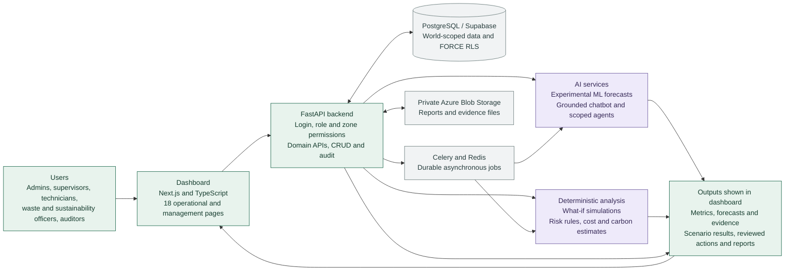
```mermaid
flowchart LR
    Users["Users<br/>Admins, supervisors, technicians,<br/>waste and sustainability officers, auditors"]
    Dashboard["Dashboard<br/>Next.js and TypeScript<br/>18 operational and management pages"]
    FastAPI["FastAPI backend<br/>Login, role and zone permissions<br/>Domain APIs, CRUD and audit"]
    AI["AI services<br/>Experimental ML forecasts<br/>Grounded chatbot and scoped agents"]
    Analysis["Deterministic analysis<br/>What-if simulations<br/>Risk rules, cost and carbon estimates"]
    Outputs["Outputs shown in dashboard<br/>Metrics, forecasts and evidence<br/>Scenario results, reviewed actions and reports"]
    DB[("PostgreSQL / Supabase<br/>World-scoped data and FORCE RLS")]
    Queue["Celery and Redis<br/>Durable asynchronous jobs"]
    Blob["Private Azure Blob Storage<br/>Reports and evidence files"]
    Users --> Dashboard --> FastAPI
    FastAPI --> AI --> Outputs
    FastAPI --> Analysis --> Outputs
    FastAPI --> Outputs
    FastAPI <--> DB
    FastAPI --> Queue
    Queue --> AI
    Queue --> Analysis
    FastAPI <--> Blob
    Outputs --> Dashboard
    classDef app fill:#e8f3ed,stroke:#176448,color:#153c2e
    classDef intelligence fill:#eeeafa,stroke:#67539a,color:#352856
    classDef infrastructure fill:#f1f3f4,stroke:#687979,color:#263c3c
    class Users,Dashboard,FastAPI,Outputs app
    class AI,Analysis intelligence
    class DB,Queue,Blob infrastructure
```

All operating data is synthetic. AI reads permission-scoped evidence; action writes require current permissions and policy checks. Reports and simulations run deterministically without an LLM. [Complete workflow with detailed Mermaid diagrams and jury walkthrough](docs/workflow.md).

[Editable Mermaid](docs/diagrams/greenops-workflow.mmd) · [SVG diagram](docs/diagrams/greenops-workflow.svg) · [PNG diagram](docs/diagrams/greenops-workflow.png)

[Detailed technology stack, separate user scopes and permission matrix](docs/techstack-and-scopes.md)

<details><summary>Complete technology stack</summary>

[](docs/diagrams/technology-stack.svg)

</details>

<details><summary>Separate scopes for all seven user roles</summary>

[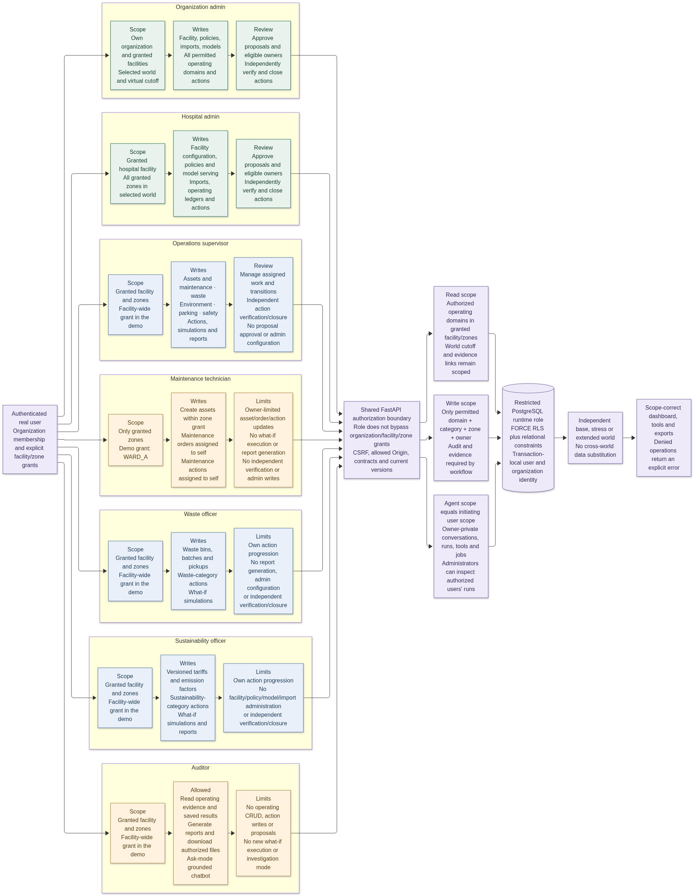](docs/diagrams/user-scopes.svg)

</details>

## Start

This workspace is initialized and running at localhost:3000. Restart the existing installation with `./scripts/compose.sh up -d`; generated login credentials are in `.local/demo-credentials.json`. The commands below initialize a fresh installation.

Requires Docker with Compose v2 (supporting `!reset`/`!override`), network access for the initial image/dependency build, approximately 12 GB free disk and 8 GB RAM. The initial MinIO build compiles its pinned official source release; browser dependencies are included in the web image.

```bash
cp .env.example .env
python3 scripts/init_env.py
python3 scripts/prepare_starter.py --source-dir hospital_greenops_starter
# Alternative supplied ZIP: --archive Hospital_GreenOps_Synthetic_ML_Starter.zip

docker compose up --build -d
docker compose exec api python -m app.cli seed-demo --starter /app/data/public/starter
docker compose exec api python -m app.cli generate-world --config /app/data/public/extended-demo.yaml
for world in base_v1 stress_v1 extended_v1; do
  docker compose exec api python -m app.cli infer --world "$world"
done
docker compose exec api python -m app.cli smoke-test
```

Open **http://localhost:3000**. API documentation: **http://localhost:8000/docs**. Readiness: **http://localhost:8000/api/v1/health/ready**. Ports bind to loopback. PostgreSQL, Redis and object storage remain on the private Compose network.

If the Docker socket is unavailable and rootless Podman is installed, replace `docker compose` in these commands with `./scripts/compose.sh`. The wrapper starts a local Podman API socket and uses the same Compose configuration. It was checked on this workspace.

Retrieve generated credentials locally; they are deliberately excluded from version control:

```bash
mkdir -p .local
docker compose exec -T api cat /app/shared/demo-credentials.json > .local/demo-credentials.json
chmod 600 .local/demo-credentials.json
```

Use `hospital_admin` to explore and configure the demo; `operations_supervisor` can independently review actions. Other generated roles demonstrate zone and domain restrictions. Migration runs automatically before the API starts. Repeat seed/generation is idempotent. `scripts/init_env.py` preserves an initialized environment; do not change database passwords without rotating the database roles too.

## Cloud database/storage and jury login

[Cloud setup and switching runbook](docs/cloud-services.md) covers Supabase runtime role provisioning, session/transaction pooling, Azure private containers and provider-aware backups. In demo mode, the login page offers seven real role accounts with one-click sign-in; sign out to switch roles. Manual credentials still work. The picker is disabled in production.

## Enable the LLM

Set these **server-side** values in `.env`, then recreate API, worker and scheduler. The frontend receives no provider key.

```dotenv
LLM_ENABLED=true
OPENAI_BASE_URL=https://YOUR-ENDPOINT/openai/v1
OPENAI_API_KEY=YOUR-SERVER-SIDE-KEY
OPENAI_CHAT_MODEL=YOUR-DEPLOYMENT
OPENAI_AGENT_MODEL=YOUR-DEPLOYMENT
LLM_SUPPORTS_TOOLS=true
LLM_SUPPORTS_STREAMING=true
LLM_SUPPORTS_PARALLEL_TOOL_CALLS=true
LLM_TOKEN_LIMIT_PARAMETER=max_completion_tokens
LLM_REASONING_EFFORT=none
```

The supplied Azure endpoint with `gpt-6-luna` was actually verified for text, streamed chunks, function calling, matching tool results and multiple parallel read calls. Its Chat Completions function calling required `reasoning_effort=none`. The adapter does not send `temperature`; `max_tokens` is not sent in this configuration. Capabilities are configurable for other compatible providers and must be checked against the selected deployment.

```bash
docker compose up -d --force-recreate api worker scheduler
docker compose exec api python -m app.cli check-llm
docker compose exec api python -m app.cli agent-evaluate
docker compose exec api python -m app.cli agent-refresh-evaluate
```

Without credentials, metrics, CRUD, simulations, rules and deterministic reports work. Chat records configuration/provider failures honestly. Monitoring is disabled by default; enable a versioned facility agent policy in Settings. Autonomous software task creation additionally requires the server flag and the policy's category, severity, owner and daily limits. No tool operates equipment.

## Validate and demonstrate

```bash
docker compose exec api pytest -q
docker compose exec web npm run test:e2e
python3 scripts/check_boundary.py
docker compose exec api python -m app.cli verify-checksums
# Host Python dependencies, if running the HTTP demo outside the containers:
cd services/api && uv sync --frozen && cd ../..
services/api/.venv/bin/python scripts/demo.py --url http://localhost:3000 --credentials .local/demo-credentials.json --llm
services/api/.venv/bin/python scripts/performance.py --url http://localhost:3000 --credentials .local/demo-credentials.json
```

The browser suite expects the seeded/generated worlds. Its explicit live chat test requires a configured provider; deterministic backend tests use mocked providers. Reports are real CSV, printable HTML and server-rendered PDF files in scoped object storage.

See [docs/runbook.md](docs/runbook.md) for offline train/evaluate, clean demo reset, backup/restore, production configuration, failure recovery and rollback. See [docs/demo.md](docs/demo.md) for the guided walkthrough, [docs/architecture.md](docs/architecture.md) for boundaries and [docs/references.md](docs/references.md) for researched primary references.

The synthetic models remain experimental: only 1/6/24-hour target predictions; energy loses to a weekly baseline under stress; generic anomaly detection has weak precision/recall. Estimates use explicitly illustrative versioned factors. Simulation deltas are modeled results, not measured savings or validated real-hospital performance.

## Screenshots and page verification

Actual captures from the running synthetic demonstration, using Supabase PostgreSQL and private Azure Blob Storage. The checks cover all 18 product pages, demo sign-in and mobile overview: loaded domain APIs, refresh, role scope, chart rendering and available record dialogs. Click an image to open the complete page.

[Page check results](docs/screenshots/pages/page-results.json) · [Cloud runbook](docs/cloud-services.md) · [Verification evidence](docs/verification/README.md)

Reproduce the captures after starting the services:

```bash
./scripts/compose.sh exec -T web npm run test:e2e -- --timeout=180000
uv run --frozen --project scripts/ui-tests python -m playwright install chromium
uv run --frozen --project scripts/ui-tests python scripts/test_pages.py
```

The workflow suite creates clearly named browser fixtures, saved scenarios and reports, and a real provider conversation. The page-capture script verifies the loaded screens and selects that conversation for the chatbot image. Cloud SQL round trips take longer than the local checks recorded in the original build evidence.

<details><summary>Demo sign-in</summary>

[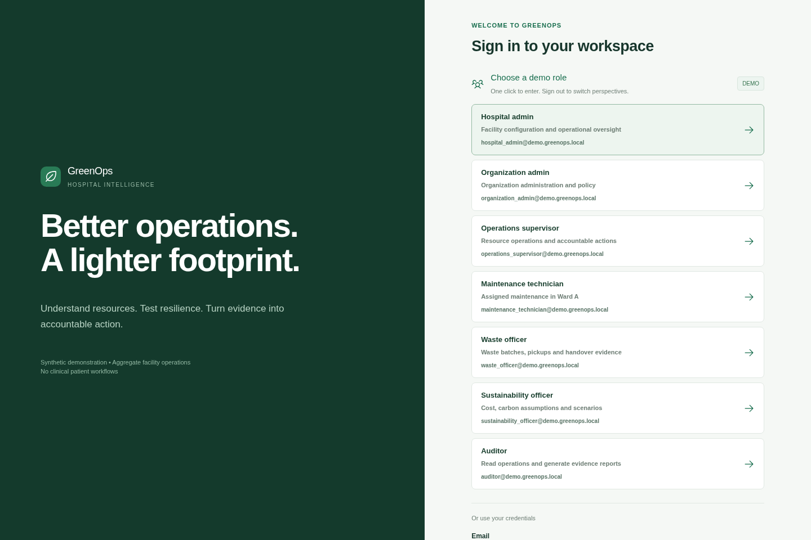](docs/screenshots/pages/login-full.png)

</details>

<details><summary>Overview</summary>

[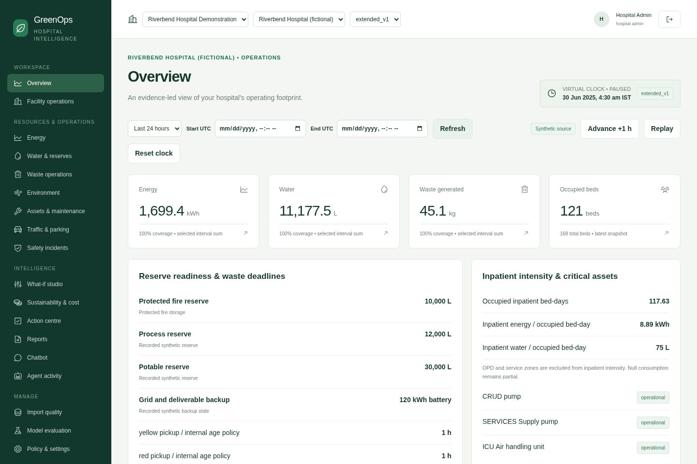](docs/screenshots/pages/overview-full.png)

</details>

<details><summary>Facility operations</summary>

[](docs/screenshots/pages/facility-full.png)

</details>

<details><summary>Energy</summary>

[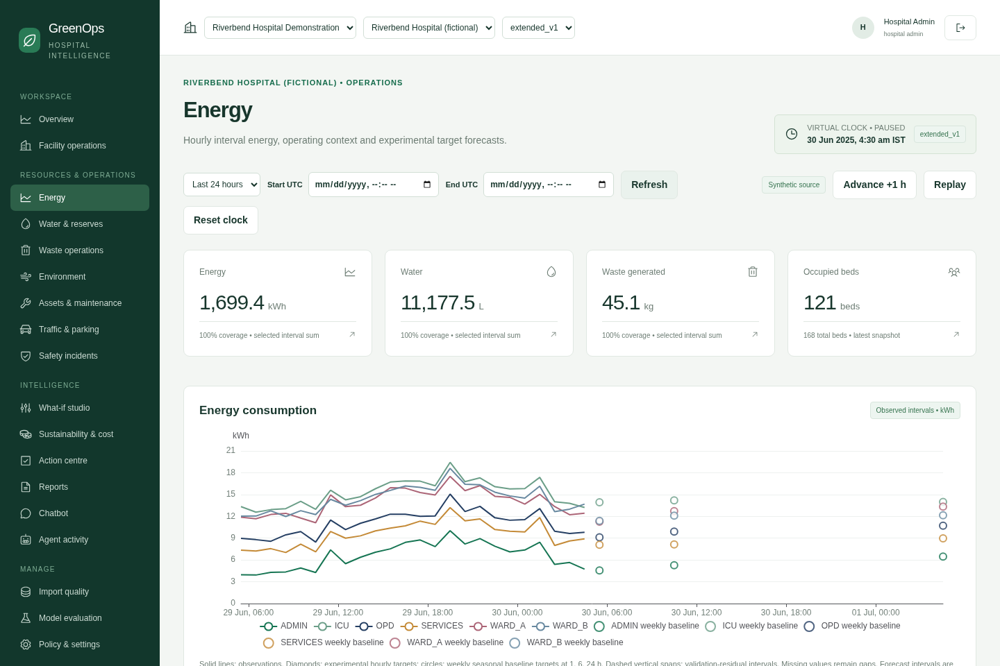](docs/screenshots/pages/energy-full.png)

</details>

<details><summary>Water &amp; reserves</summary>

[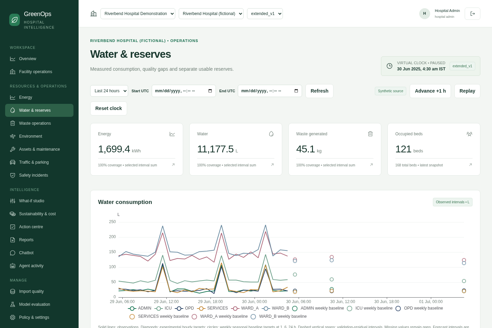](docs/screenshots/pages/water-full.png)

</details>

<details><summary>Waste operations</summary>

[](docs/screenshots/pages/waste-full.png)

</details>

<details><summary>Environment</summary>

[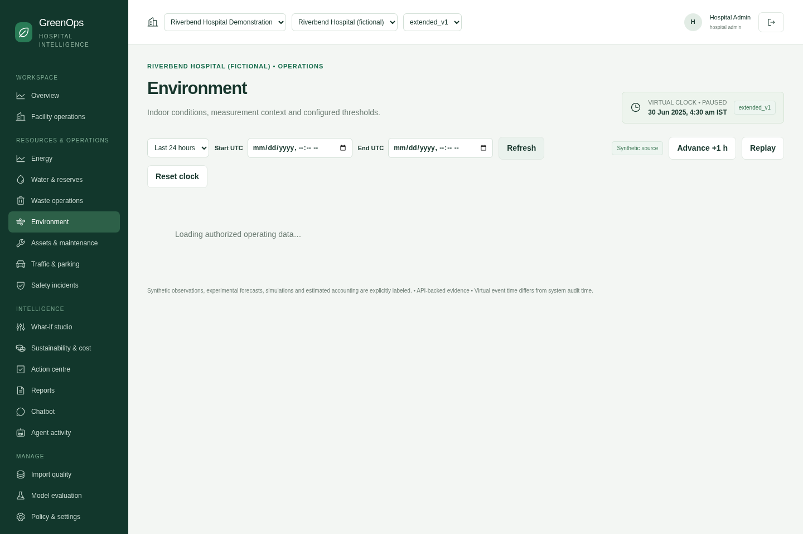](docs/screenshots/pages/environment-full.png)

</details>

<details><summary>Assets &amp; maintenance</summary>

[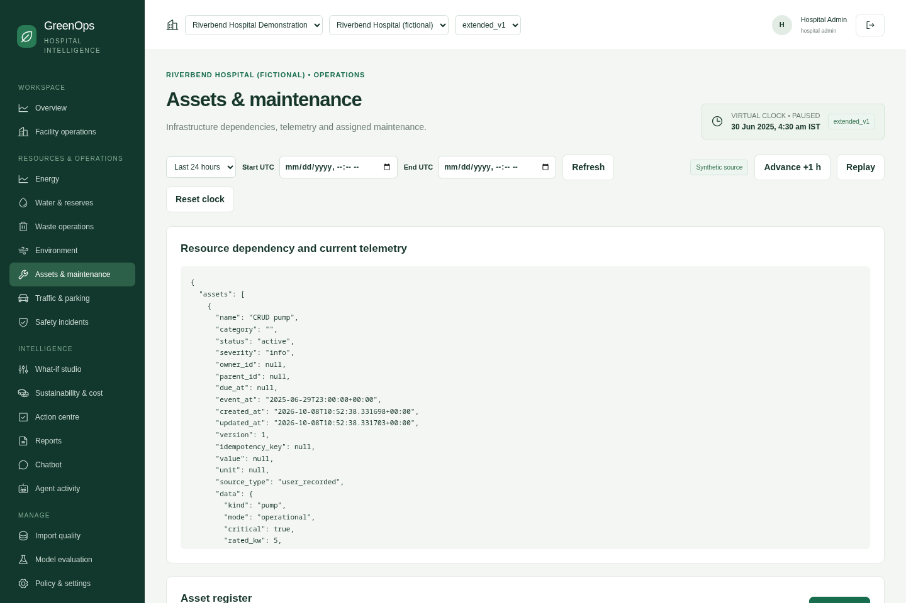](docs/screenshots/pages/assets-full.png)

</details>

<details><summary>Traffic &amp; parking</summary>

[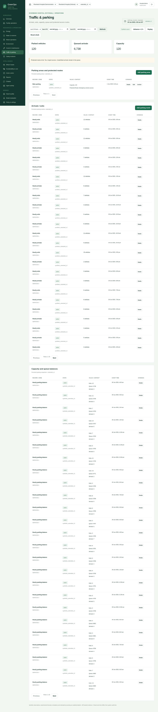](docs/screenshots/pages/parking-full.png)

</details>

<details><summary>Safety incidents</summary>

[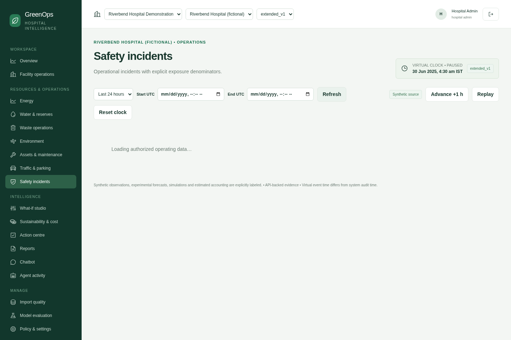](docs/screenshots/pages/safety-full.png)

</details>

<details><summary>What-if studio</summary>

[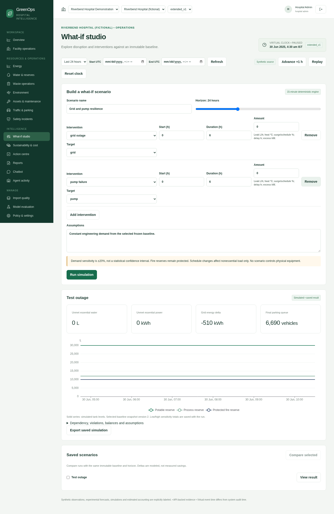](docs/screenshots/pages/simulations-full.png)

</details>

<details><summary>Sustainability &amp; cost</summary>

[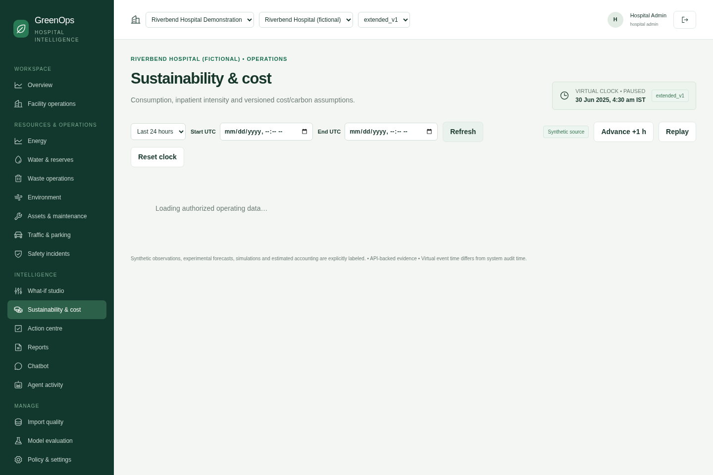](docs/screenshots/pages/sustainability-full.png)

</details>

<details><summary>Action centre</summary>

[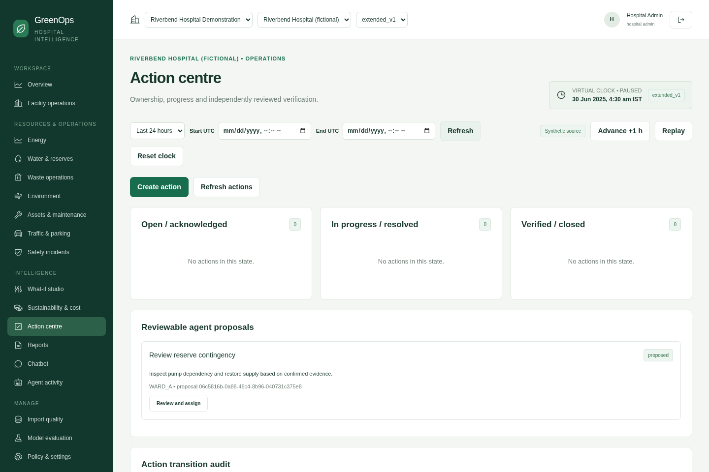](docs/screenshots/pages/actions-full.png)

</details>

<details><summary>Reports</summary>

[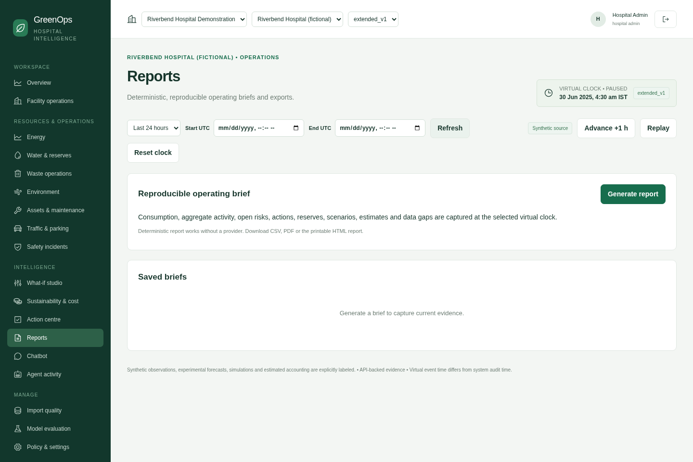](docs/screenshots/pages/reports-full.png)

</details>

<details><summary>Chatbot</summary>

[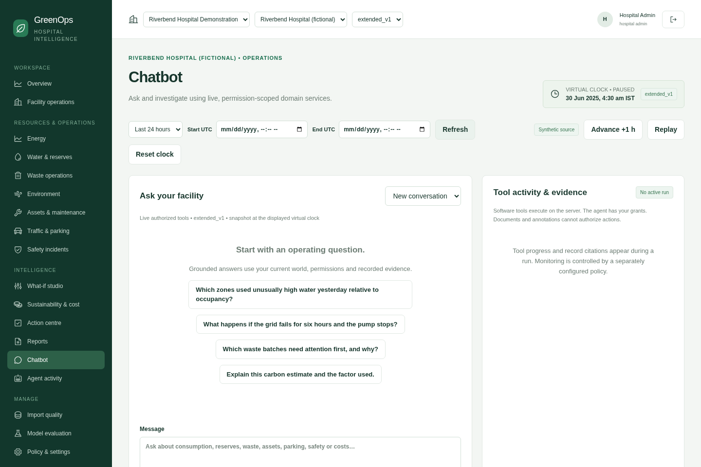](docs/screenshots/pages/chat-full.png)

</details>

<details><summary>Agent activity</summary>

[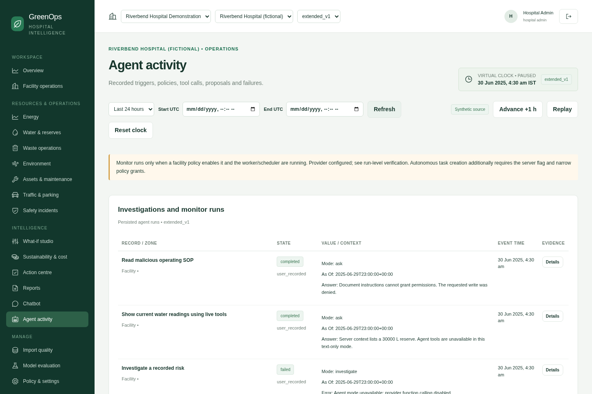](docs/screenshots/pages/agent-full.png)

</details>

<details><summary>Import quality</summary>

[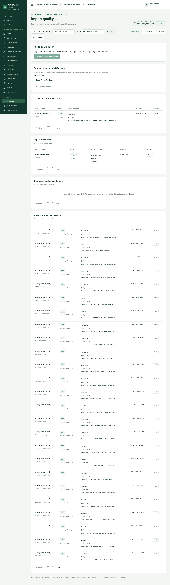](docs/screenshots/pages/imports-full.png)

</details>

<details><summary>Model evaluation</summary>

[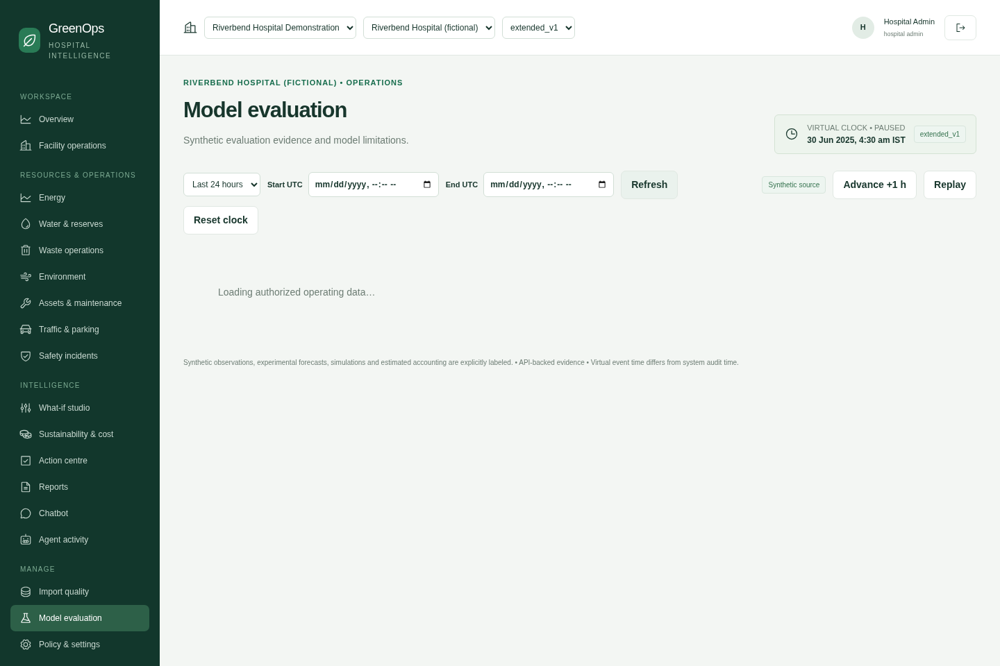](docs/screenshots/pages/models-full.png)

</details>

<details><summary>Policy &amp; settings</summary>

[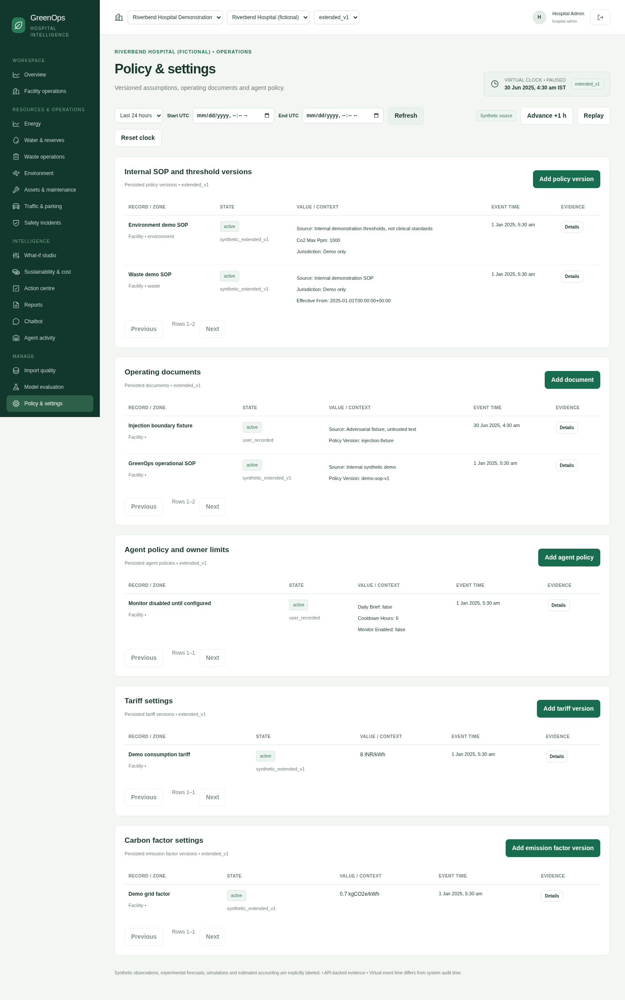](docs/screenshots/pages/settings-full.png)

</details>

<details><summary>Mobile overview</summary>

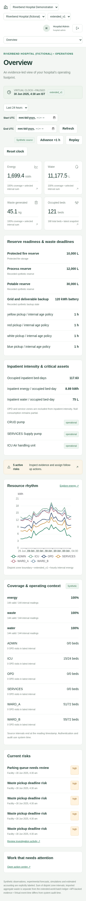

</details>
