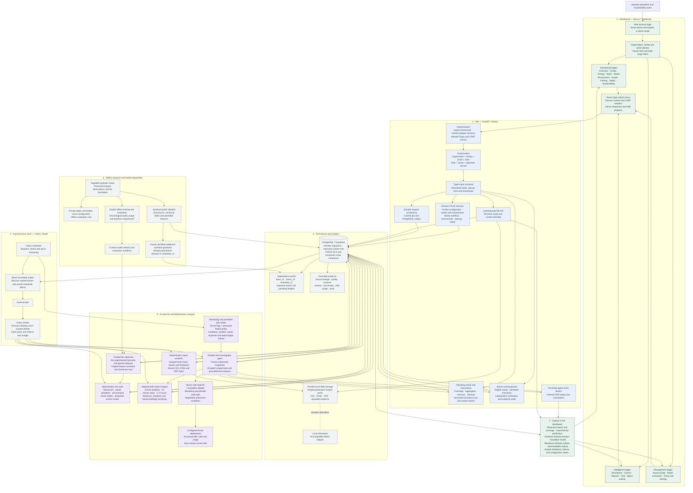
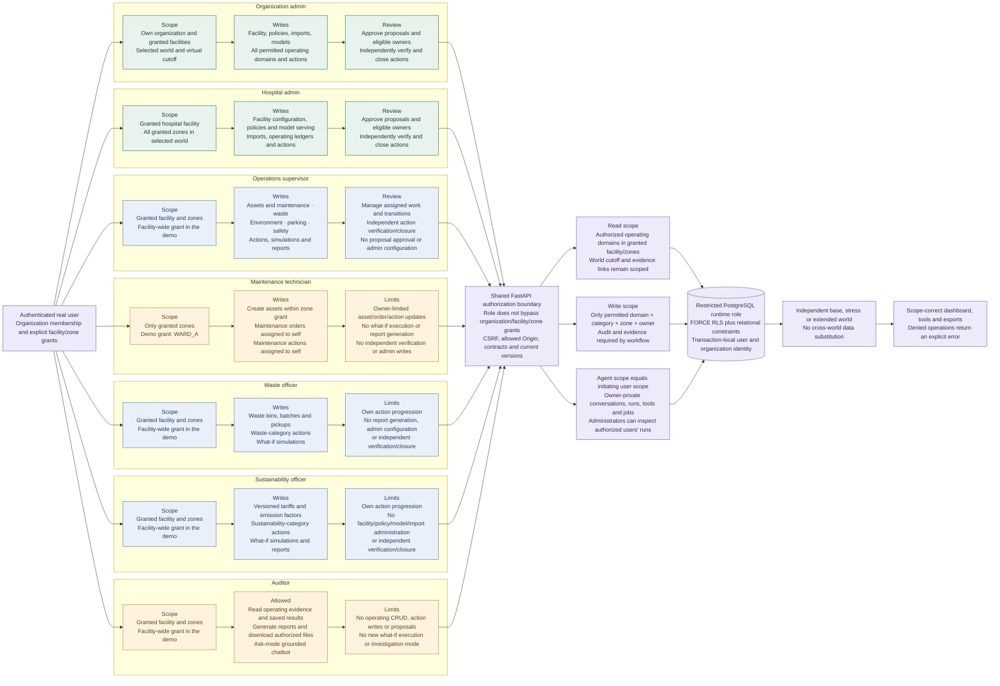

# Hospital GreenOps AI — technology stack and user scopes

These diagrams follow the implemented permission checks and database policies. Roles define permitted operations; organization membership, facility grants, zone grants, record ownership and selected world further restrict every request. All hospital operating data is synthetic.

## Technology stack

[Editable Mermaid](diagrams/technology-stack.mmd) · [SVG](diagrams/technology-stack.svg) · [PNG](diagrams/technology-stack.png)

The offline private-truth branch has no runtime connection. An agent can use only authorized tools; it cannot query SQL, read the filesystem, run shell commands or operate hospital equipment. The runtime has no arbitrary model-upload execution path. Reports, risk rules and simulations work without the LLM.

## Separate user scopes

[Editable Mermaid](diagrams/user-scopes.mmd) · [SVG](diagrams/user-scopes.svg) · [PNG](diagrams/user-scopes.png)

Operational reads are governed by grants and RLS, rather than invented role-specific data silos. A waste or sustainability officer with a facility-wide grant can read authorized context from other operational domains. Domain write permission remains narrow. The technician's zone grant excludes facility-wide rows that have no granted zone.

## Permission matrix

“Yes” always means **within explicit grants** and subject to the operation's additional contract, ownership and evidence checks.

| Capability | Org admin | Hospital admin | Supervisor | Technician | Waste officer | Sustainability officer | Auditor |
|---|---|---|---|---|---|---|---|
| Read scoped operational data | Yes | Yes | Yes | Granted zones | Yes | Yes | Yes |
| Facility, policy, import and model administration | Yes | Yes | No | No | No | No | No |
| Assets and maintenance CRUD | Yes | Yes | Yes | Granted zones; own updates/orders | No | No | No |
| Waste workflow CRUD | Yes | Yes | Yes | No | Yes | No | No |
| Environment, parking and safety CRUD | Yes | Yes | Yes | No | No | No | No |
| Tariff and emission-factor versions | Yes | Yes | No | No | No | Yes | No |
| New what-if simulations | Yes | Yes | Yes | No | Yes | Yes | No |
| Generate reports | Yes | Yes | Yes | No | No | Yes | Yes |
| Ask-mode chatbot | Yes | Yes | Yes | Within zone grant | Yes | Yes | Yes |
| Investigate and draft | Yes | Yes | Yes | Tools remain zone/role constrained | Yes | Yes | No |
| Create actions | Yes | Yes | Yes | Maintenance; self | Waste category | Sustainability category | No |
| Approve an action proposal | Yes | Yes | No | No | No | No | No |
| Independently verify and close actions | Yes | Yes | Yes | No | No | No | No |
| Inspect another user's agent run/job | Within scope | Within scope | No | No | No | No | No |

The two admin roles currently share the same domain permission set. Their effective visibility comes from membership and facility/zone grants; the diagram does not imply that an organization admin can access an ungranted facility. The runtime's monitor service account is not a jury login. It has an operations-supervisor membership and still requires enabled server/facility policy before autonomous task creation.

Authorization sources: [role permissions and grant resolution](../services/api/app/core/auth.py), [domain contracts](../services/api/app/domains/contracts.py), [CRUD ownership checks](../services/api/app/domains/crud.py), [action transitions](../services/api/app/domains/actions.py), [agent tool restrictions](../services/api/app/ai/tools.py), [proposal approval](../services/api/app/routes.py), [database role policies](../services/api/alembic/versions/0004_write_permissions.py) and [demo grant setup](../services/api/app/bootstrap.py).

[Complete operational workflow](workflow.md) · [README and screenshot gallery](../README.md) · [Architecture](architecture.md)
