# Hospital GreenOps AI: complete system workflow

These diagrams describe the implemented product. Hospital data is explicitly synthetic and limited to operations and sustainability. Virtual event time determines operating state; system time controls authentication, auditing, leases and scheduling.

For separate diagrams of the full technology stack and all seven role scopes, see [Technology stack and user scopes](techstack-and-scopes.md).

## 1. Users → Dashboard → FastAPI → AI services → Outputs

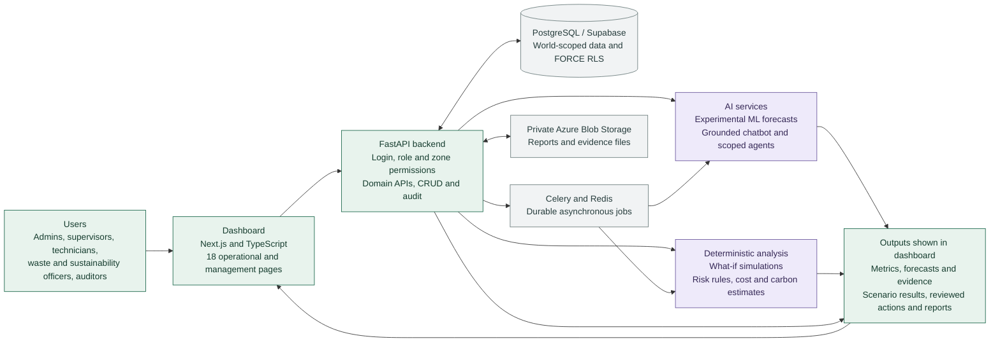

[Editable Mermaid source](diagrams/greenops-workflow.mmd)

[SVG diagram](diagrams/greenops-workflow.svg) · [PNG diagram](diagrams/greenops-workflow.png)

### Detailed operating journey

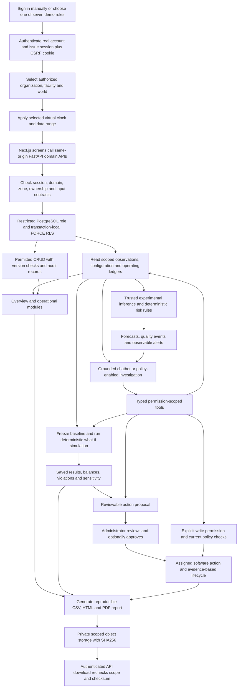

Operational screens cover facility, energy, water/reserves, waste, environment, assets/maintenance, parking, safety and sustainability. Supporting screens expose simulations, actions, reports, chat, agent activity, import quality, model evaluation and policy/settings. There are 18 product pages plus sign-in.

## 2. Technology and trust boundaries

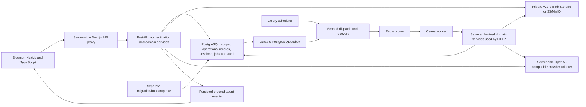

The configured cloud installation uses Supabase PostgreSQL 17, private Azure Blob Storage and Azure's OpenAI-compatible endpoint. Local Compose also supports PostgreSQL 18 and MinIO. Provider and storage keys stay server-side. The API, worker and scheduler do not receive the privileged migration URL. Agents receive typed tool interfaces rather than SQL, shell or filesystem access.

## 3. Authentication and ordinary domain requests

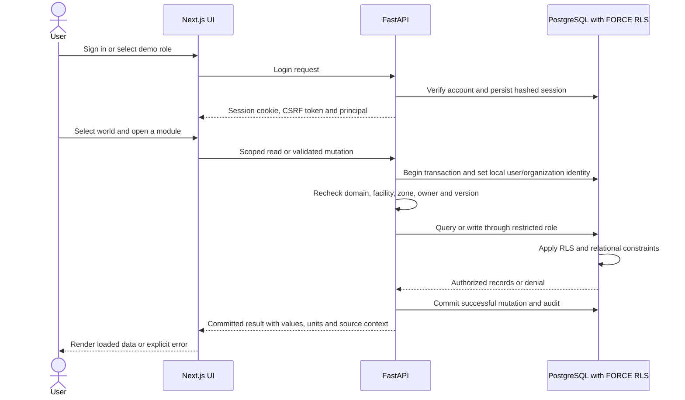

Seven demo roles are organization admin, hospital admin, operations supervisor, maintenance technician, waste officer, sustainability officer and auditor. The demo picker uses actual account authentication and is disabled in production. Writes require CSRF and an allowed Origin. Sign-out clears cached scope and operating data before another user signs in.

## 4. Data ingestion and world separation

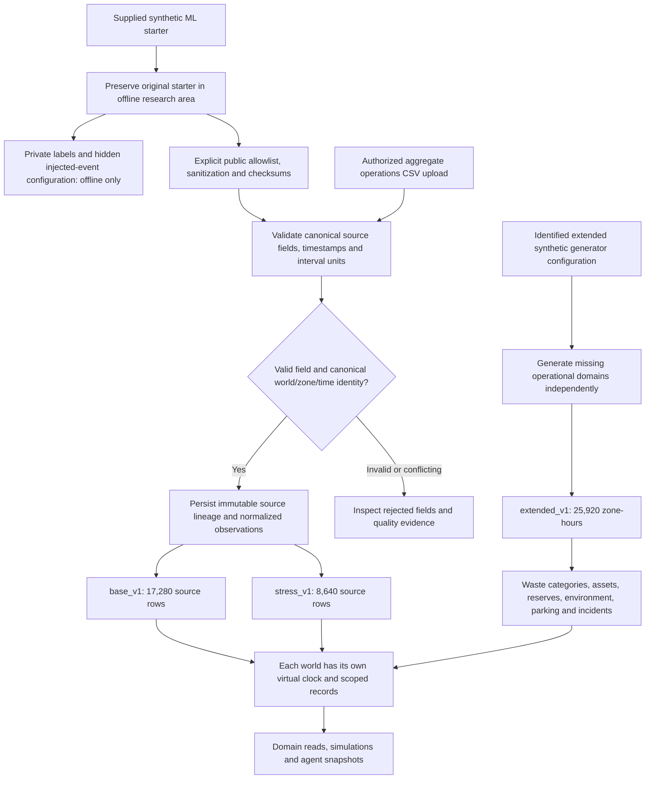

Missing water remains missing. Invalid fields do not erase valid fields from the source row. Duplicate imports cannot silently replace conflicting canonical observations. Extended-world category waste is a separate synthetic ledger; it is not reconstructed from base/stress aggregate waste. Hidden truth is never copied into runtime documents, object storage or agent context.

## 5. Experimental ML and observable rules

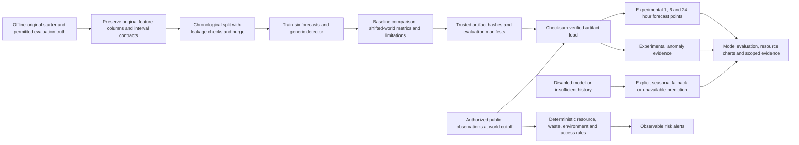

Training is an explicit isolated offline command, not an arbitrary uploaded-model execution path. Energy gains become negative under stress; the generic detector has weak precision/recall. Forecasts and fallback states are labeled. These models do not establish real-hospital accuracy or savings.

## 6. Deterministic what-if simulations

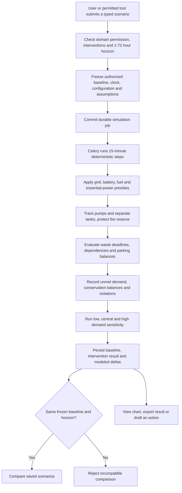

Supported interventions include grid outage, pump failure, supply interruption, occupancy/OPD surge, heat, water leak, excess energy, pickup timing, schedules, asset restoration and rainfall. Sensitivity is not a confidence interval; modeled deltas are not measured savings.

## 7. Grounded chatbot and agent tools

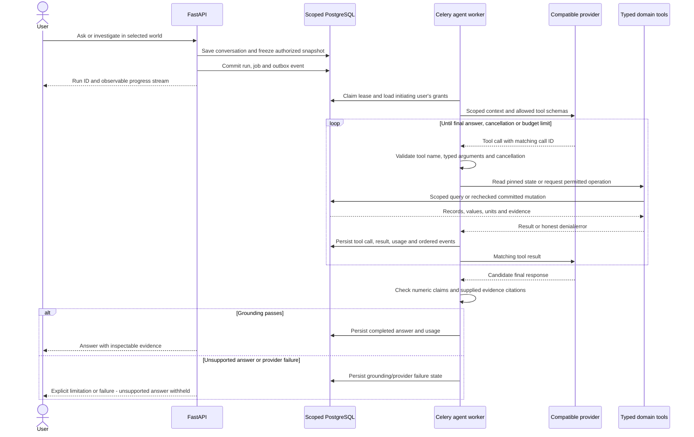

Nineteen tools cover facility/catalog/metrics/context, assets, reserves, waste, environment, parking/safety, forecasts, alerts, actions, sustainability, document search, simulations/comparisons, proposals and permitted action writes. Parallel read tool calls are supported; mutations run sequentially. Documents are untrusted input and cannot grant access. The provider key is never sent to the browser.

Scheduled monitoring adds observable triggers → enabled versioned policy → cooldown check → frozen investigation → evidence → relevant simulation → proposal. Autonomous software task creation additionally requires the server flag, current policy, permitted category/severity/owner, incident state, duplicate prevention and daily budget. A tool never operates physical equipment.

## 8. Proposal review and action lifecycle

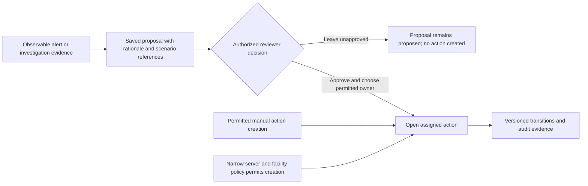

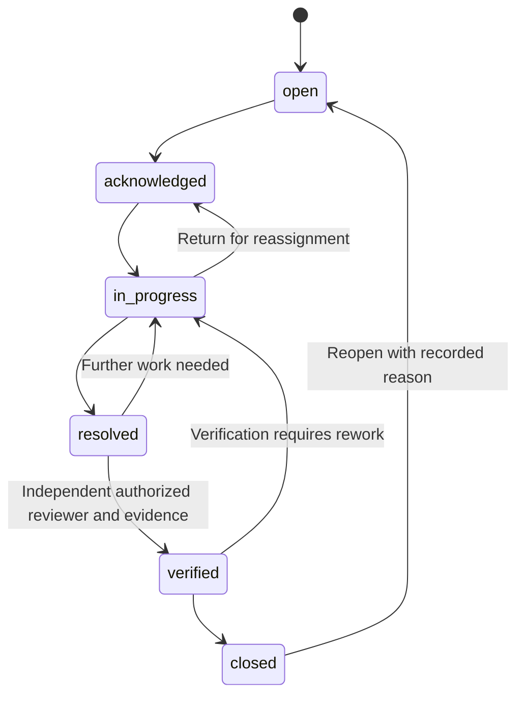

Creation checks the domain, zone, category, eligible owner, due date and linked evidence. Transitions check current scope, ownership/role, optimistic version and reason. Verification requires evidence and independent review. A simulation or generated proposal alone does not prove action success or savings.

## 9. Jobs, recovery and reports

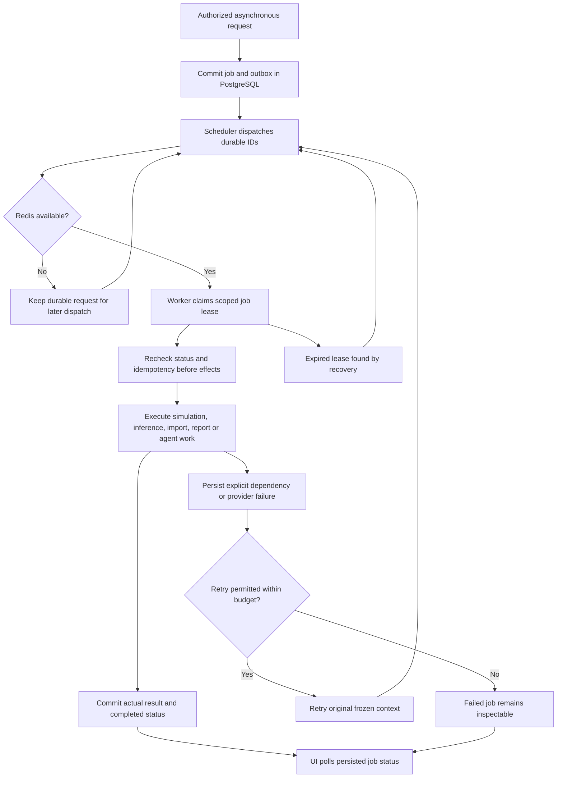

```mermaid
flowchart LR
    Request["Choose world, virtual cutoff and report window"] --> Facts["Freeze scoped facts, factors, quality gaps and limitations"]
    Facts --> Render["Deterministically render CSV, printable HTML and PDF"]
    Render --> Upload["Upload private object and compute SHA256"]
    Upload --> Metadata["Persist scoped file metadata and report record"]
    Metadata --> Link["UI shows authenticated download links"]
    Link --> Check["API rechecks world/zone permission and checksum"]
    Check --> File["Return actual file bytes"]
```

Azure uses a private container and the `hospital-greenops/` prefix in this installation. S3/MinIO uses the same logical scoped keys. No browser storage credential or public blob URL is required. Deterministic reports work without the LLM.

## Jury walkthrough

1. Select Hospital admin on the sign-in screen; explain the fictional hospital, selected world and paused virtual clock.
2. Open Overview, Energy and Water to show measured interval values, coverage, reserves and experimental forecast labels.
3. Show Waste, Assets, Environment, Parking and Safety with their actual scoped ledgers.
4. Run a six-hour grid/pump disruption, inspect unmet demand and balances, and compare another scenario on the same baseline.
5. Ask the chatbot for current water reserves; inspect its tool activity and evidence links.
6. Show the saved proposal and independently reviewed action workflow; explain the server/policy limits on automatic task creation.
7. Generate a report and download its actual PDF/CSV; show model limitations and import-quality evidence.
8. Sign out and select a technician or auditor to demonstrate narrower access.

[README and screenshots](../README.md) · [Architecture](architecture.md) · [Build evidence](build-status.md) · [Verification output](verification/README.md) · [Cloud runbook](cloud-services.md)

Reproduce the diagram validation and main PNG/SVG exports:

```bash
npm install --prefix .local/mermaid-validation --no-save --ignore-scripts mermaid@12.1.0
uv run --frozen --project scripts/ui-tests python -m playwright install chromium
uv run --frozen --project scripts/ui-tests python scripts/validate_workflow.py
```
