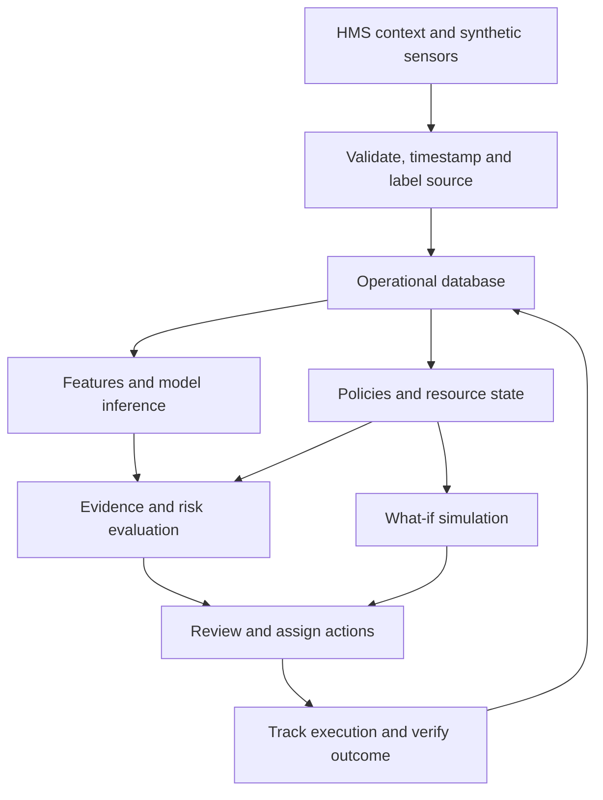
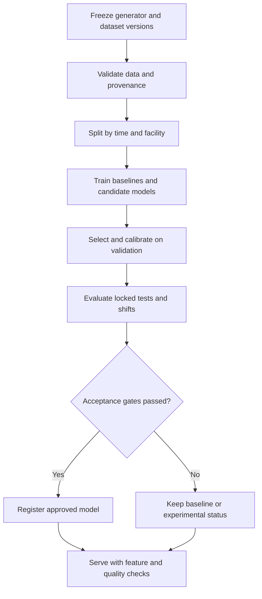

# Hospital Operations + GreenOps AI: Full Product Technical Workflow Plan

Version 1.0 | 8 October 2026 | Confirmed scope: Operations + GreenOps | Data strategy: synthetic first

## 1. Product contract

Hum hospital management context aur facility sustainability ko ek configurable product mein connect karenge. Hospital example facility hai; energy/water/alerts/scenario engine reusable rahega. Core question: **facility ki current condition kya hai, agla operational risk kya ho sakta hai, kis evidence par conclusion hai, aur kis owner ko kya action lena hai?**

Confirmed scope mein wards, beds, aggregate occupancy, OPD activity, assets, maintenance, resource consumption, waste collection, environment, traffic/parking, safety incidents, resilience simulation, cost/carbon estimates aur action tracking hain. Clinical diagnosis, prescriptions, patient billing aur insurance workflows is release ka scope nahi hain. HMS integration se aggregate operational events consume honge; patient identity/resource prediction ke liye zaroori nahi.

Full-product specification aur runnable starter ko distinguish karein. Is delivery mein technical blueprint complete hai aur offline synthetic-data/ML foundation implemented/tested hai. Authenticated web backend, database migrations, frontend pages, integrations aur deployment abhi build backlog hain. Synthetic model quality real hospital accuracy ya compliance certification prove nahi karti.

### Product ka complete decision loop



## 2. Full module inventory

| Module | Inputs / records | Product output | Main method |
|---|---|---|---|
| Facility/HMS operations | Zones, bed capacity, occupancy snapshots, OPD counts, service schedules | Hospital operating context and resource-adjusted views | Transactional records and aggregation |
| Energy | Interval/cumulative meters, loads, schedules, weather | Demand forecast, unusual use, peak exposure, approved schedule options | Forecasting + contextual residuals + rules |
| Water | Flow, usage, source, tank levels, inflow, cleaning/occupancy | Excess-use candidates, reserve projection, shortage alerts | Forecasting + mass balance + rules |
| Waste | Category, batch age, fill, weight, pickup/handover | Fill forecast, service deadline, constrained pickup plan, evidence gaps | Growth forecast + policy engine + scheduling |
| Environment | Indoor PM2.5, CO2, temperature/humidity; separate outdoor context | Trends, configured threshold alerts, inspection recommendations | Time-window aggregation + quality checks |
| Assets and maintenance | Asset ID, runtime, operating mode, telemetry, work orders | Utilization, condition alerts, planned maintenance queue | Rules initially; validated fault model later |
| Traffic/parking | Zone arrivals/exits, capacity, designated paths | Occupancy forecast, congestion indicators, approved diversion suggestions | Count forecasts + capacity model |
| Safety incidents | Structured facility incident, severity, location, closure | Hotspots and trend summaries with denominator | Counts/rates and descriptive analytics |
| Climate/resilience | Synthetic weather/advisories, resource reserves, dependencies | Heat, outage, water-shortage and rainfall scenarios | Discrete-time resource simulation |
| Sustainability/cost | Consumption, tariff version, factor/year/boundary, actions | Estimated resource/cost/carbon trend and internal scorecard | Versioned arithmetic; no LLM arithmetic |
| Action centre | Alert, owner, deadline, approval, work evidence | Prioritized work queue and verifiable closure | State machine and audit log |
| Reporting and explainability | Snapshots, model/rule versions, sources, unknowns | Daily brief, trend report, evidence drill-down | Templates + optional grounded LLM |

Energy/water/waste, action centre aur one resilience scenario pehle working release mein honge. Baaki modules subsequent product increments mein functional banenge. Marketing/UI mein planned cards ko working inference ke roop mein show na karein.

## 3. Users, permissions and workflows

| Role | Read access | Permitted actions |
|---|---|---|
| Organization admin | Organization facilities and access configuration | Facility setup, memberships, policy approvals |
| Hospital administrator | Facility overview, risks, approved scenario results | Assign/escalate tasks and approve operational plans |
| Operations supervisor | Facility zone queues and service schedules | Review alerts, assign team tasks, record inspections |
| Maintenance technician | Assigned assets/zones/tasks | Acknowledge work, log progress, attach completion evidence |
| Waste officer | Category/batch/pickup ledger and waste queue | Record handover, review deadline gaps and collection plans |
| Sustainability officer | Trends, method definitions, estimates | Compare approved periods and generate reports |
| Reviewer/auditor | Permitted historical records and evidence | Read/export; no operational mutations |

Permissions server-side enforce honge. JWT/OIDC identity se organization/facility membership resolve karein; request payload ka facility_id alone access authorization nahi hai. PostgreSQL row security defence-in-depth option hai; owner/superuser bypass ko samajhkar application role configure karein. [T4, T5]

### Facility setup

Organization create → facility type/location/timezone → buildings/floors/zones → beds and essential services → assets/meters/tanks/bins/parking areas → resource dependencies → approved schedules, tariffs and policy versions → users/owners → synthetic feed enable → ingestion quality check.

### HMS operational context

An adapter receives aggregate occupancy snapshots and OPD/service activity. Example event: `zone.occupancy.updated`, effective time, occupied count, staffed capacity, source/event ID. Validate counts and deduplicate source IDs. Preserve event time and receipt time; late updates can recompute historical aggregates, but already-issued forecasts retain their original input snapshot.

For a richer occupancy simulator, maintain de-identified admission/transfer/discharge events with generated case tokens solely inside the simulator. Aggregate them before sending to resource analytics. Do not copy real patient records into the demo generator.

## 4. Synthetic data system: full design

### Generate causal operating worlds, not unrelated random columns

Use one event simulator that owns the physical/operational state. Generate facility parameters first, shared drivers second, resource observations third and faults/interventions last. This keeps occupancy, demand, tank reserve, collection events and outages consistent.

Recommended training campaign configuration: six fictional facilities across different bed sizes, climates, service mixes and infrastructure reliability; up to twelve zones per facility; 365 days of hourly analytics. Six × twelve × 365 × 24 = **630,720 zone-hour records** before metric expansion. This is a proposed scalable campaign, not the size of the included starter.

The included starter contains four zones, 168 configured inpatient beds, 180 base days and 90 stress days: **17,280 + 8,640 = 25,920 records**. The OPD zone has zero inpatient beds. Its source metadata is synthetic throughout. It models energy/water, aggregate waste and simple reserve scenarios; it does not generate every full-product domain yet.

### Configuration fields

| Entity | Configurable properties |
|---|---|
| Facility | Type, climate profile, area, bed capacity, service mix, timezone |
| Zone | Staffed capacity, essential-service flag, operating schedule, occupancy profile |
| Energy asset | Base load, duty cycle, cooling sensitivity, measured/estimated source |
| Water system | Usable volume, inflow/pump dependence, demand drivers, source/quality class |
| Waste stream | Category, bin capacity, generation profile, pickup schedule and policy reference |
| Environment | Indoor/outdoor flag, sensor noise, drift, missingness and configured thresholds |
| Parking | Capacity, arrival/service profiles, reserved routes, exits |
| Staff/task | Role, shift, skill, zone permissions, service duration and workload capacity |

### Shared simulator state

Time advances through a single virtual clock. HMS activity affects demand and waste generation; weather affects cooling demand; grid status affects pump/load availability; tank inflow/outflow updates storage; pickup creates handover events rather than simply deleting waste.

Every physics equation and coefficient is a configurable modelling assumption. Synthetic simulation demonstrates system behaviour under those assumptions; it does not establish causal effects in an actual hospital.

### Initial equations

Energy interval kWh = `(base kW + occupancy contribution + scheduled activity contribution + cooling contribution) × interval hours + noise + fault excess`.

Water interval L = `occupancy requirement + OPD/service activity + cleaning schedule + noise + physical excess`.

Tank next volume = `clip(current volume + inflow × Δt − demand × Δt − excess × Δt, 0, capacity)`. Track unmet demand separately if available water is insufficient; clipping alone must not hide shortage.

Waste next stock = `current stock + generated − collected`. Create batch/category records and preserve oldest uncollected generation timestamp. Mass and fill are separate sensor quantities; conversion needs calibrated capacity/density. Prototype's aggregate kg-based fill is explicitly a simplifying assumption.

Parking next occupancy = `current + accepted arrivals − departures`, limited by capacity. Rejected/waiting arrivals should be recorded, not clipped away. Device telemetry must condition on asset operating mode so normal startup spikes do not become generic faults.

### Fault and intervention catalogue

| Scenario | Ground truth | Expected observable distinction |
|---|---|---|
| Persistent water excess | Added physical loss for a duration | Usage rises beyond context; reserve drains faster |
| Legitimate cleaning/OPD surge | Scheduled activity; no fault | Elevated use explained by activity |
| Energy control fault | Added operating load or abnormal duty cycle | Contextual residual and persistence |
| Waste pickup delay | Collection event skipped | Fill and/or age deadline worsens |
| Incorrect manual record | Conflicting handover/count record | Data conflict, not automatic physical conclusion |
| Grid outage | Supply interruption with resource dependencies | Pump/backup consequences and unmet load |
| Heat stress | Shifted weather with increased cooling demand | Demand/capacity exposure under configured equations |
| Sensor missing/stuck/drift | Measurement defect, physical state separate | Quality flag; dependent inference can be withheld |
| Asset fault | Component state change before labelled failure | Condition telemetry changes by operating mode |
| Parking surge | Arrivals exceed capacity | Waiting/congestion and essential-route exposure |
| Repair/pickup intervention | Explicit action event | Later state changes; outcome must be checked |

Keep negative examples and overlapping events. Unknown data is a real state, not a normal-state label.

### Dataset families

Use `train_worlds`, `validation_worlds`, `held_out_time`, `held_out_facilities`, `shifted_worlds`, `quality_fault_worlds` and `intervention_worlds`. They serve different tests. Freeze the test/stress specification before model selection. Separate generator seed, scenario interval, latent physical state and fault truth from model input data.

Full data campaign should vary generator structures as well as parameters. The bundled stress world changes seed, demand coefficients, drift, noise and event strength but shares the same generator family. Its metrics do not prove generalization to independent physical mechanisms.

## 5. Data contract and ingestion

Canonical observation envelope:

```json
{
  "event_id": "synthetic-ward-a-water-20250108T010000Z",
  "organization_id": "demo-org",
  "facility_id": "demo-hospital",
  "zone_id": "ward-a",
  "asset_id": "water-meter-a",
  "metric": "water_interval_volume",
  "value": 240.0,
  "unit": "L",
  "interval_start": "2025-01-08T00:00:00Z",
  "observed_at": "2025-01-08T01:00:00Z",
  "source_type": "synthetic",
  "quality": "ok",
  "schema_version": 1
}
```

Receive → validate schema/permissions → validate unit and range → deduplicate `(source,event_id)` → store immutable raw event → normalize → save quality flags → update current state/aggregates → enqueue inference. Failed rows go to a review queue with reason. Batch response returns accepted/rejected counts plus per-row errors. Repeating a batch must not double-count usage.

Store UTC as timezone-aware values and display facility local time. kW, interval kWh and cumulative kWh have separate metric identifiers; derive intervals from cumulative meters with reset events. Avoid silent zero fill. Historical backfill can repair views while forecast snapshots remain reproducible. Parameterize expected reporting cadence; fast demo replay does not change the original source timestamps.

Quality gates: duplicate, unknown asset, wrong unit, negative resource amount, out-of-capacity occupancy, missing sensor, stuck sensor, implausible change, late event and conflicting records. Display stale/partial/unknown states on the dashboard.

## 6. Database design

Use PostgreSQL with SQLAlchemy and Alembic. All business tables carry organization/facility scope, UUID identity and UTC timestamps as applicable. History tables are append-only where practical. Use transactions for action state changes and outbox events. Start with indexed ordinary tables; partition hourly observations when measured volume/queries justify it.

| Table | Key fields and relationships |
|---|---|
| organizations | id, name, configuration |
| facilities | organization_id, type, timezone, location, area, configured capacity |
| buildings / floors / zones | facility-scoped hierarchy, service type, essential flag |
| beds / capacity_snapshots | zone, staffed/available/occupied counts, effective time |
| operational_events | external event ID, kind, effective/receipt times, aggregate payload |
| assets | facility/zone, asset type, capacity, mode, maintenance metadata |
| resource_dependencies | upstream/downstream asset, relation, constraint version |
| sensor_sources / observations | metric/unit mapping; event ID, value, source, quality, times |
| quality_events | observation/source, reason, interval, review state |
| tanks / tank_snapshots | source/quality class, capacity, usable reserve, inflow/outflow |
| bins / waste_batches | category, capacity, generation time, weight, location, barcode reference |
| waste_movements | batch, from/to, time, quantity, pickup/handover/treatment evidence |
| environmental_readings | indoor/outdoor, pollutant/unit, averaging basis, source |
| parking_areas / parking_events | capacity, essential paths, counts and arrival/exit event |
| safety_incidents | location, kind, severity, observed time, review and closure |
| maintenance_plans / work_orders | asset, interval/mode, assignee, status and service evidence |
| model_registry / training_runs | target/horizon, data/feature/code hashes, metrics, status |
| forecast_runs / forecast_points | issue time, input snapshot, model version, horizon and ranges |
| policy_versions / policy_assignments | scope, effective dates, thresholds, source, approval |
| alerts / alert_evidence | dedup key, severity, deadline, hypothesis, immutable evidence links |
| actions / action_history | assignee, transition, previous version, reason, timestamps |
| scenario_runs / scenario_results | assumptions, model/rule version, baseline/intervention states |
| tariff_versions / emission_factors | source, year, boundary, units, effective dates |
| report_snapshots | filters, provenance, generation time and rendered output reference |
| memberships / role_grants / audit_events | principal, scope, permitted operations, actor/action audit |
| outbox / job_runs | committed event, delivery status, attempt count, idempotency key |

Index observations by `(facility_id, asset_id, metric, observed_at)` and establish an event uniqueness constraint. Alert deduplication key can combine facility/zone/metric/rule version/active incident window. Asset-zone relationships must share facility scope; foreign keys alone should not permit cross-facility linkage.

## 7. ML training workflow



### What to train and what to calculate

| Capability | Model candidate | Target / label | Baseline / non-ML component |
|---|---|---|---|
| Energy forecast | Histogram gradient boosting, direct horizon | Hourly energy t+1/t+6/t+24 | Previous-day/week same hour |
| Water demand forecast | Same model family | Hourly volume t+1/t+6/t+24 | Previous-day/week same hour |
| Occupancy forecast | Count/regression model | Aggregate zone counts by horizon | Current occupancy/scheduled activity |
| Waste generation | Regression/count forecast | Category mass generated over next interval | Recent rate and scheduled activity |
| Bin service risk | Forecast samples propagated through stock | Threshold crossing, evaluated against simulator | Rate-based crossing + age policy |
| Parking forecast | Count/gradient boosting | Occupancy/arrivals by horizon | Current + recent arrival/exit rates |
| Contextual anomaly | Residual threshold plus Isolation Forest | Unsupervised score; private truth for evaluation | Domain rules and known activity |
| Asset failure candidate | Classifier/survival model after label design | Fault/failure in future operating window | Condition rules and maintenance intervals |
| Environment monitoring | Optional temporal model if needed | Relevant pollutant trend | Configured averaging/threshold rules |
| Reserve and backup | Resource simulation, not trained classifier | Resource adequacy over time | Mass/energy balance |
| Task/route scheduling | Constrained optimization | Feasible plan, deadline/capacity cost | Priority queue/approved route graph |
| Cost/carbon | Versioned deterministic arithmetic | Consumption × applicable rate/factor | Explicit accounting boundary |

Full LLM fine-tuning is not required to make this product trainable. Main training work numerical forecasting and, where meaningful labels exist, detection/condition models mein hoga. LLM can explain approved structured results without changing their calculations.

### Feature design

Calendar features, lagged usage, past rolling summaries, occupancy/activity available at issue time, known schedules, operating mode and weather forecast available at issue time are eligible. Fit preprocessors only on training data. Predictor feature allowlists explicitly exclude `event_id`, `fault_kind`, `ground_truth`, `repair_success`, hidden physical losses and future measured inputs.

Direct 1/6/24-hour models use only origin-known data. A 24-hour-ahead hourly forecast is not total next-day demand. For daily totals, train a distinct next-day-sum target or sum properly issued hourly horizon forecasts with a documented error/covariance treatment. Do not feed actual future usage into later steps of a recursive forecast.

For failure targets, define forecast issue time, lead interval, failure event and censoring. Current maintenance decision or hindsight diagnosis must not leak into pre-failure features. A classifier trained on synthetic failure labels is a simulator-specific research candidate until external validation.

### Splits and selection

Use shared chronological boundaries across zones. Purge training targets crossing into validation and validation targets crossing into test. A gap should reflect overlapping labels/horizons, not a cosmetic fixed row count. Add facility-group holdouts and independent scenario worlds in the full training campaign.

The bundled starter uses common 60/20/20 temporal boundaries, one preset candidate per target/horizon, validation residual calibration and untouched final-time/stress evaluation. It contains no random shuffled split. Official scikit-learn documentation supports direct numerical models and chronological evaluation; those methods still need product-specific validation. [T1, T2]

### Metrics and release gates

| Model/service | Report | Proposed release condition |
|---|---|---|
| Forecast | MAE/RMSE by horizon, zone and world; baseline improvement | Beat useful baseline in relevant domains; otherwise serve baseline |
| Interval | Nominal level, actual coverage and width by horizon/world | Display actual calibration limits; disable misleading narrow ranges |
| Anomaly | Precision/recall, events detected, delay, deduplicated alerts/day | Operations-approved false-alert budget and sensitivity |
| Waste | Threshold timing error, deadline misses, infeasible plans | Never label missing age/treatment evidence as compliant |
| Asset candidate | PR-AUC/recall/lead time, class balance, censoring details | Experimental until meaningful faults and pilot validation |
| Simulator | Conservation, capacity, unmet demand, replay determinism | Pass invariants; disclose assumptions |
| Explanation | Numerical consistency, evidence linkage, unsupported statements | Validated schema and facts; template fallback |

Thresholds are agreed product acceptance targets, not achieved claims. Do not select favourable metrics or hide stress failures. Isolation Forest returns outlier scores, not a calibrated percentage probability of a leak. [T3]

## 8. Runtime inference, rules and action workflow

New valid observation → feature snapshot → model lookup by metric/horizon/facility profile → input freshness/schema checks → inference → ranges and evidence → rules/context → deduplication → incident alert → ranked task recommendation.

An alert includes `hypothesis`, `severity`, `urgency`, `evidence_ids`, `model_version`, `rule_version`, `observed_window`, `source_type`, `quality`, `unknowns`, `suggested_action`, `owner_role`, `due_at` and `estimated_impact_assumptions`. Inferred causes remain hypotheses until verified.

### Prioritization

First handle essential-service exposure, then time-sensitive handling requirements, then non-critical resource/cost opportunities. Rank within a class by time-to-breach, affected zone, persistence and approved operating policy. Weak evidence reduces certainty but must not hide a severe potential hazard; create a verification/escalation action when appropriate.

### Alert lifecycle and action lifecycle

An alert can be active/acknowledged/suppressed/resolved, with approved suppression reason/expiry. Its action has explicit transitions:

`open → acknowledged → in_progress → resolved → verified → closed`.

Reopen if verification fails. Each transition checks role, current version and required evidence. Use optimistic concurrency; two users must not overwrite each other's update. Completion evidence can be inspection note, pickup/handover record or subsequent resource readings. A click on “resolved” does not prove the physical issue disappeared.

## 9. What-if engine

Each run freezes an initial state and compares baseline and interventions over the same horizon. Use discrete time steps—e.g., 15 minutes for resource reserve—not independent cosmetic slider multipliers. Inputs include temperature/advisory scenario, outage duration, essential demand, available capacities, stock, pump dependency, personnel and allowed response actions.

| Scenario | State to propagate | Outputs |
|---|---|---|
| Grid outage | Available power, battery/fuel, pumps, tank reserve, essential load | Runtime, unmet load/water and action deadlines |
| Heat condition | Weather input, cooling sensitivity/capacity, occupancy | Demand exposure and capacity shortfall under assumptions |
| Water supply interruption | Inflow, usable source-specific reserve, demand and excess | Time to reserve threshold and unmet volume |
| OPD/occupancy surge | Service activity, resource demand, waste and parking | Resource/collection/capacity pressure |
| Collection delay | Category generation, stock, batch age and available shifts | Pickup priorities and infeasible deadlines |
| Heavy rainfall | Explicit facility vulnerability/drainage assumptions | Preparedness/inspection scenario; no unsupported inundation prediction |

Water example: 30,000 usable L / 3,000 L/hour = 10 hours without inflow. Extra 500 L/hour reduces it to about 8.57 hours. Repair scenario removes the assumed excess, not a measured real effect. Battery example in starter uses 120 **deliverable** kWh / 60 kW = 2 hours; efficiencies are already inside deliverable capacity. Genset runtime needs a separate fuel/load curve. Never merge potable, technical and protected fire reserves.

## 10. Backend services and architecture choices

Use a modular monolith first: FastAPI, PostgreSQL, SQLAlchemy/Alembic, Python/scikit-learn and Next.js/TypeScript. Use direct OpenAI-compatible client for optional explanations if chosen; no LangChain dependency needed. Start with deterministic narratives so external API availability does not block operations.

| Service/module | Responsibility |
|---|---|
| identity | Membership, role checks and permitted facility scope |
| facilities / operations | Master data, capacity and HMS context |
| ingestion / quality | Data contracts, source adapters, dedup and quality events |
| resource domains | Energy, water, waste, environment, assets, parking and incidents |
| analytics | Feature builders, forecasts, contextual detection and metrics |
| policies | Versioned thresholds, applicable SOP and decisions |
| scenarios | Dependency/resource simulation and intervention comparisons |
| alerts / actions | Incidents, task transitions, assignments and evidence |
| reporting / explanations | Grounded briefs and export snapshots |
| model registry / jobs | Training metadata, approvals, background runs and replay |

Training jobs run outside HTTP request workers. A PostgreSQL-backed job/outbox queue is adequate first; Redis plus a dedicated queue can be added when throughput justifies it. This keeps initial deployment small. Persist job status/attempts and make handlers idempotent.

### Proposed repository organization

| Path | Contents |
|---|---|
| `backend/app/api/v1/` | Domain routers and versioned request/response contracts |
| `backend/app/core/` | Configuration, authentication, authorization and errors |
| `backend/app/models/` and `schemas/` | Database models and Pydantic contracts |
| `backend/app/services/` | Domain logic, policies, state transitions and scenarios |
| `backend/app/jobs/` | Ingestion, inference, replay and training orchestration |
| `backend/migrations/` | Alembic schema/history changes |
| `frontend/app/` and `components/` | Role pages, charts, forms, evidence and scenarios |
| `ml/features/`, `training/`, `evaluation/` | Shared feature contracts, models and metrics |
| `simulator/` | Facility configuration, latent state, telemetry and private labels |
| `tests/` | Behaviour, authorization, leakage, conservation and end-to-end checks |
| `infra/` | Docker definitions, environment example, deployment and backup runbooks |

## 11. API workflow contract

Prefix `/api/v1`. Paginate lists; use request IDs and stable error codes. Mutations require permitted scope, idempotency where appropriate and audit trails. Long jobs return `202`, job ID and status URL. Source/quality/model provenance appears in prediction responses.

| Domain | Endpoints | Main contract |
|---|---|---|
| Identity | `GET /me`, `GET /memberships` | Actor and permitted facilities/roles |
| Facility | `POST /facilities`, `POST /zones`, `POST /assets` | Master data with shared scope validation |
| Operations | `POST /operational-events/batch`, `GET /zones/{id}/occupancy` | Effective time and dedup source-event ID |
| Ingestion | `POST /observations/batch`, `POST /imports`, `GET /imports/{id}` | Accepted/rejected rows; jobs for big imports |
| Overview | `GET /facilities/{id}/overview` | Domain state, essential risks and freshness |
| Series | `GET /zones/{id}/series` | Metric, units, interval, aggregation and source |
| Forecast | `POST /forecast-runs`, `GET /forecast-runs/{id}` | Issue-time snapshot, model, horizon and actual interval meaning |
| Waste | `POST /waste-batches`, `POST /waste-movements` | Category, original generation time and chain of evidence |
| Maintenance | `POST /work-orders`, `PATCH /work-orders/{id}` | Asset, assignee, permitted state and evidence |
| Alerts | `GET /alerts`, `GET /alerts/{id}/evidence`, `PATCH /alerts/{id}` | Active hypothesis, dedup, review/suppression reason |
| Actions | `POST /actions`, `PATCH /actions/{id}`, `POST /actions/{id}/verify` | Versioned transition and verification |
| Scenarios | `POST /scenario-runs`, `GET /scenario-runs/{id}` | Frozen assumptions, baseline/intervention and unmet needs |
| Models | `POST /training-runs`, `GET /models`, `POST /models/{id}/approve` | Restricted operator role; locked tests and approval |
| Evaluation | `GET /evaluation` | Per-horizon/world results and baseline comparisons |
| Reports | `POST /reports`, `GET /reports/{id}` | Snapshot/provenance and permitted scope |
| Demo replay | `POST /replay-runs`, `PATCH /replay-runs/{id}` | Authorized synthetic mode; virtual clock |

Example forecast response must say whether `predicted_value` is hourly usage, day-total or another target; include `issued_at`, `target_interval`, `unit`, `lower`, `upper`, `nominal_interval`, `coverage_report`, `source_type`, `quality_status` and `model_version`. A placeholder confidence percentage is not part of the contract.

## 12. Frontend page plan

| Page | Required content and interactions |
|---|---|
| Facility setup | Buildings/zones, capacities, sensors, dependencies, policies and roles |
| Operations overview | Occupancy/activity, resources, urgent issues, freshness and source mode |
| Facility map | Zone status, essential services and resource connections; drill-down |
| Energy | Current versus expected, forecasts by horizon, schedule/context and actions |
| Water | Volume/flow, source-specific reserve, excess candidates and inspection queue |
| Waste | Category/batch ledger, age/fill, handover evidence and pickup schedule |
| Environment | Indoor/outdoor distinction, units/averaging period and freshness |
| Assets | Utilization by operating mode, maintenance history and condition queue |
| Parking/safety | Capacity/arrival trends and facility incident hotspots |
| Scenario lab | Explicit assumptions, baseline/intervention trajectories and unmet demand |
| Action centre | Owner, priority, deadline, state, evidence and verification |
| Sustainability | Method-defined indicators, estimated costs/carbon and separate critical status |
| Models/data quality | Metrics, baselines, experimental/approved status and missing/stale data |
| Reports | Filtered reviewed briefs and export with source/method metadata |

Use one facility/time-range context across pages. Charts label synthetic/replayed data. Every alert has an evidence drawer. UI supports loading, empty, missing-data, stale-source, job-failure and permission states. A configurable index must expose weights and coverage; critical incidents stay visible outside the score.

## 13. Explanation and optional agent workflow

Numerical services produce structured results. Rules select allowed inspection/collection options. An explanation component narrates evidence, estimated impact, assumptions and unknowns. Validate numerical facts and source links against the input snapshot before publishing; use deterministic fallback if validation or the external call fails.

An optional agent layer can coordinate domain summaries, request permitted read-only scenario tools and draft administrator briefs. It does not silently change hospital policies, rewrite numerical results or execute physical-control actions. Generation is supporting functionality; the system can run its resource decisions offline.

No LLM training dataset should simply contain invented authoritative hospital advice. If later fine-tuning narratives, use reviewed examples with explicit evidence, unknowns, policy versions and output schemas. It still needs separate factual-consistency evaluation.

## 14. Implementation backlog with dependencies

| Phase | Tasks | Depends on | Exit condition |
|---|---|---|---|
| P0: Contracts | Facility/metric schema, roles, feature allowlist, scenario assumptions | Confirmed scope | Data/UI/backend agree on units and semantics |
| P1: Synthetic foundation | Shared simulator, seeded worlds, hidden labels, quality events | P0 | Reproducible datasets and conservation checks |
| P2: Backend core | Database/migrations, identity/scope, ingest, operations/master data | P0 | Authenticated idempotent read/write workflows |
| P3: Analytics | Baselines, direct forecasts, anomaly candidate, evaluation/registry | P1 | Actual metrics; approved/experimental model status |
| P4: Core product | Energy/water/waste views, evidence, alerts, actions and verification | P2, P3 | End-to-end user scenario works |
| P5: Resilience | Shared dependency simulator and reviewed recommendations | P1, P4 | Resource balances, capacity/unmet-demand outputs |
| P6: Full domains | Environment, assets, parking, incidents and reporting | P2, P4 | Each planned domain functional and scoped |
| P7: Integration/release | Job recovery, RBAC isolation, Docker/Azure deployment, backup/restore | P4–P6 | Tested, repeatable deployment and runbooks |
| P8: Pilot | Actual meter/log mapping, calibration, shadow evaluation | P7 and authorized pilot data | Evidence for real performance and claims |

Conditional delivery estimate for a small experienced team: a narrow hackathon demonstrator in the available event window; complete synthetic product increment approximately 4–6 weeks depending on team/time; real pilot validation a separate phase. These are planning estimates, not verified organizer timelines or guaranteed deadlines. Full feature inventory should not be promised as finished in 24 hours.

### Suggested work streams

Backend owner handles contracts, persistence, scope checks, jobs and action lifecycle. Frontend owner builds shared facility/time context, domain pages, evidence and scenarios. Data/ML owner handles simulator, feature parity, training, metrics and model approval. Integration/testing can be shared. These are team roles, not delegated agents or assumed team size.

## 15. Acceptance and failure handling

| Test | Required result |
|---|---|
| Same import repeated | No duplicate usage or duplicate active alerts |
| Cross-facility request | Denied server-side; no data exposure |
| Event out of order | Preserve event/receipt time; replay/backfill consistently |
| Occupancy-driven legitimate surge | Context explained; no confirmed fault claim |
| Missing sensor | Unknown/partial data; no silent zero or compliant status |
| Future rows altered | Earlier origin feature snapshots unchanged |
| Training horizon boundary | Labels do not cross held-out split boundaries |
| New facility/changed coefficients | Actual stress metrics shown; no hidden promotion |
| Waste age unknown | Request evidence; no invented compliant deadline |
| Conflicting pickup/treatment records | Evidence gap retained and reviewed |
| No feasible pickup plan | Explicit unmet task/deadline and escalation |
| Essential resource exhausted | Show unmet demand, not only clipped reserve |
| “Resolved” without verification | Issue not closed as verified |
| Concurrent task update | Version conflict instead of silent overwrite |
| Explanation provider fails | Deterministic factual explanation still available |
| Worker restart | Retry safely; no duplicate work or lost committed events |
| Export/report | Synthetic/source/model/policy assumptions included |

## 16. Deployment and operations plan

Development Docker stack: frontend, API, worker and PostgreSQL; optional LLM integration remains server-side. Store secrets outside source, expose required public application/API routes, keep the database private, and define readiness separately from liveness. Train with pinned dependencies and bounded CPU threads.

Azure path: containerized frontend/API/worker on a suitable container service or a VM for initial demo; managed PostgreSQL/object storage when moving to pilot. Choose after measuring jobs, budget and environment constraints; current prices are not estimated here. Use migrations as a controlled release step and keep artifact/schema compatibility documented.

Operational telemetry: ingestion lag, invalid records, job retries, inference latency, missing data, alert volume, model baseline gap, interval coverage and action verification outcomes. Back up database and model/config snapshots; test restoration. Keep rollback to previous approved model/rule version. Retaining a model without its feature/environment version is insufficient for reproducible serving.

## 17. Delivered runnable foundation and results

The accompanying ZIP contains source, dependencies, tests, base/stress observations, private evaluation labels, seven trained model artifacts, prediction CSVs, `evaluation.json`, scenario examples, result interpretation and a copy of this plan.

Implemented starter methods: direct energy/water forecasts at 1/6/24 hours using HistGradientBoostingRegressor; Isolation Forest outlier detection; deterministic water/waste scenario functions; action-transition validation. Training and behavioural checks were executed in this workspace. The bundled results are actual synthetic-run metrics, not placeholders.

Eight tests cover reproducibility, input/occupancy/duplicate checks, hidden-label exclusion, future-feature leakage, split purging, reserve mass balance, waste-age priority and verified action transitions. Complete frontend/API/auth/PostgreSQL deployment tests will be added when those components are implemented.

Commands from the extracted starter root:

```bash
python -m pip install -r requirements.txt
python -m greenops.pipeline generate --days 180 --stress-days 90 --seed 42
python -m greenops.pipeline train
python -m greenops.pipeline demo
python -m unittest discover -s tests -v
```

Use Python 3.12 with the supplied pinned versions for the packaged model artifacts. Regenerate/retrain when versions/configs change. Read the starter's `RESULTS.md`: stress-world degradation and false alarms are deliberately visible, and models failing release criteria stay experimental.

## 18. Technical references and provenance

This plan builds on the previously reviewed problem statement/presentation and `Hospital_GreenOps_AI_Research_Report.md`. Domain policies from that research need versioned local review before operational deployment. The design here uses synthetic policy/threshold settings rather than claiming universal hospital limits.

| ID | Primary technical source | Purpose |
|---|---|---|
| T1 | [scikit-learn HistGradientBoostingRegressor](https://scikit-learn.org/stable/modules/generated/sklearn.ensemble.HistGradientBoostingRegressor.html) | Numerical model capabilities; bundled runtime uses scikit-learn 1.8.0 |
| T2 | [scikit-learn lagged time-series example](https://scikit-learn.org/stable/auto_examples/applications/plot_time_series_lagged_features.html) | Chronological evaluation and forecasting uncertainty |
| T3 | [scikit-learn Isolation Forest](https://scikit-learn.org/stable/modules/generated/sklearn.ensemble.IsolationForest.html) | Outlier scoring semantics |
| T4 | [FastAPI security documentation](https://fastapi.tiangolo.com/tutorial/security/oauth2-jwt/) | Authenticated API foundation; product authorization still explicitly designed |
| T5 | [PostgreSQL row-security documentation](https://www.postgresql.org/docs/current/ddl-rowsecurity.html) | Facility-row access restrictions and owner/bypass limitations |

These sources were checked on 8 October 2026. Stack/service choices, schemas, campaign sizes, timelines and acceptance criteria are proposed engineering decisions. External APIs are optional for the synthetic release; no external live hospital data is implied.
